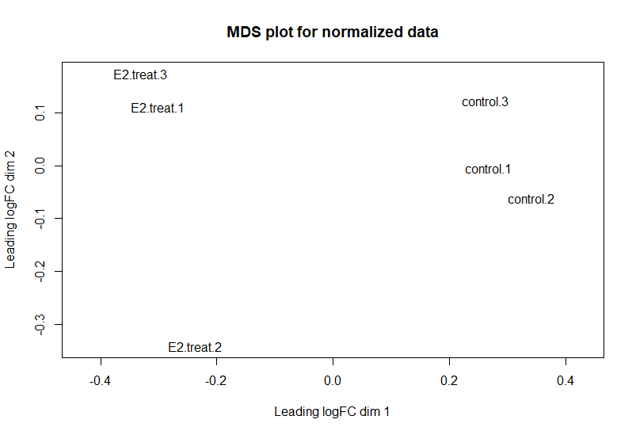

```{r setup, include=FALSE}
knitr::opts_chunk$set(eval = TRUE)
```

```{r,echo = FALSE,message=FALSE, warning=FALSE}
if (!requireNamespace("BiocManager", quietly = TRUE)){
    install.packages("BiocManager")
}

if (!requireNamespace("ComplexHeatmap", quietly = TRUE)){
  BiocManager::install("ComplexHeatmap")
}
library(ComplexHeatmap)

if (!requireNamespace("circlize", quietly = TRUE)){
  BiocManager::install("circlize")
}
library(circlize)

if (!requireNamespace("edgeR", quietly = TRUE)){
  BiocManager::install("edgeR")
}

library(edgeR)

if (!requireNamespace("limma", quietly = TRUE)){
  BiocManager::install("limma")
}

if (!requireNamespace("knitr", quietly = TRUE)){
  BiocManager::install("knitr")
}
```

# Introduction

GEO data used is GSE114260.Refer to corresponding paper, **combined** in file name means this file contains samples from both human and mice, since we only care about human, don't need to use the two **combined** file. Therefore, the **stranded_read_counts** is the data file of interest.

To clarify, **ER** in this data set stands for **estrogen receptor**, not **Endoplasmic reticulum**.In this dataset, we have 2 groups with 3 replicates each, so 6 samples in total. C4-12ERaERE (ER lacking cell line stably transfected with ERaERE) relative to the MCF7 cells were used for RNAseq analysis. The treatment group undergo paroxetine and estrogen (E2) treatment, while in control group there is only paroxetine treatment.

Raw data has been normalized using trimmed mean approaches.

# Differential Gene Expression
```{r dataImport}
normalized_count <- read.csv('normalized_count_TMM.csv')
colnames(normalized_count)[1] <- 'symbol'
rownames(normalized_count) <- normalized_count$symbol
#hist(normalized_count$control.1,breaks = 2000)
```



```{r}
heatmap_matrix <- normalized_count[,2:ncol(normalized_count)]
rownames(heatmap_matrix) <- rownames(normalized_count)
colnames(heatmap_matrix) <- colnames(normalized_count[,2:ncol(normalized_count)])
```


```{r}
heatmap_matrix <- t(scale(t(heatmap_matrix)))
if(min(heatmap_matrix) == 0){
    heatmap_col = colorRamp2(c( 0, max(heatmap_matrix)), c( "white", "red"))
  } else {
    heatmap_col = colorRamp2(c(min(heatmap_matrix), 0, max(heatmap_matrix)), c("blue", "white", "red"))
  }
current_heatmap <- Heatmap(as.matrix(heatmap_matrix),
                               show_row_dend = TRUE,
                               show_column_dend = TRUE, 
                               col=heatmap_col,
                               show_column_names = TRUE, 
                               show_row_names = FALSE,
                               show_heatmap_legend = TRUE
                               )

limma::plotMDS(heatmap_matrix,
               col = rep(c("darkgreen","blue"),10))

current_heatmap
```


Choose TMM for A1, but there are some extreme value remain and result in this heatmap, going to redo normalization by RLE.

Refer to MDS plot, which treatment group the data comes from is important. In addition, data from different sequence within same treatment group does not cluster closely, so this may also be a factor.


```{r}

data_filtered <- read.csv('data_filtered.csv')
data_filtered <- data_filtered[,-1]
rownames(data_filtered) <- data_filtered$symbol
filtered_data_matrix <- as.matrix(data_filtered[,2:7])
samples <- data.frame(lapply(colnames(data_filtered)[2:7],
FUN=function(x){tail(unlist(strsplit(x, split = "\\.")),n=2)}))
colnames(samples) <- colnames(data_filtered)[2:7]
rownames(samples) <- c("treatment",'patients')
samples <- data.frame(t(samples))
```

Use Quasi likelihood from edgeR for 2 reasons. First, refer to lecture slides, edgeR are designed for processing of RNAseq data, and Limma guide direct users to use edgeR for differential expression. Second, my model has more than one factors. 0.05 is chosen for significance threshold, as convention.

```{r edgeRQualislikelihood}
model_treatment <- model.matrix(~samples$treatment)
model_treatment_pat <- model.matrix(~samples$treatmen+samples$patients)

d = DGEList(counts=filtered_data_matrix, group=samples$treatment)
d1 <- estimateDisp(d, model_treatment)
d <- estimateDisp(d, model_treatment_pat)
d <- calcNormFactors(d)

#fit1 <- exactTest(d1, model_treatment)
fit <- glmQLFit(d, model_treatment_pat)

plotQLDisp(fit)

#qlf <- glmQLFTest(fit, coef=2:3)
qlf <- glmQLFTest(fit, coef='samples$treatmentreat')
knitr::kable(topTags(qlf),type = 'html')
```

For correction method, refer to documentation of **topTags** about **method** parameter, choice of correction method decide whether FWDR or FDR will be returned. Since we prefer FDR, feasible option are 'BH','BY' and 'fdr' where 'fdr' are equivalent to 'BH'(refer to documentation of p.adjust). Refer to the paper The control of the false discovery rate in multiple testing under dependency, if the data show positive correlation or independency, BH procedure would be feasible. In addition, the default p-value adjustment for **topTags** function is also BH, so I chose BH as adjustment method here.

```{r}
qlf_output_hits <- topTags(qlf,adjust.method = 'BH',sort.by = "PValue", n = nrow(normalized_count))
#qlf_output_hits$table
knitr::kable(cor(data_filtered[2:7]),type = 'html', digits = 3)
length(which(qlf_output_hits$table$PValue < 0.05))
length(which(qlf_output_hits$table$FDR < 0.05))
plotMD(qlf, main = 'MDplot with differentially expressed gene highlighted')
highlight <- normalized_count[rownames(normalized_count) %in% rownames(qlf$table[qlf_output_hits$table$FDR < 0.05,]),]
limma::plotMA(log(normalized_count[,c(2,5)]),
              status = rownames(normalized_count) %in% rownames(qlf$table[qlf_output_hits$table$FDR < 0.05,]), 
              main = 'MA plot with hits points highlighted')

```


```{r, heatmapFortophits}

top_hits <- rownames(qlf_output_hits$table)[qlf_output_hits$table$PValue < 0.05]
heatmap_matrix_tophits <- t(scale(t(heatmap_matrix[which(rownames(heatmap_matrix) %in% top_hits),])))
if(min(heatmap_matrix_tophits) == 0){
  heatmap_col = colorRamp2(c( 0, max(heatmap_matrix_tophits)),c( "white", "red"))
  } else {
    heatmap_col = colorRamp2(c(min(heatmap_matrix_tophits), 0,
                               max(heatmap_matrix_tophits)), c("blue", "white", "red"))
    }
current_heatmap <- Heatmap(as.matrix(heatmap_matrix_tophits),
                           cluster_rows = TRUE,
                           cluster_columns = TRUE,
                           show_row_dend = TRUE,
                           show_column_dend = TRUE,
                           col=heatmap_col,
                           show_column_names = TRUE,
                           show_row_names = FALSE,
                           show_heatmap_legend = TRUE,
                           )
current_heatmap
```

The heat map clustered.

# Thresholded over-representation analysis

```{r}
length(which(qlf_output_hits$table$FDR < 0.05 & qlf_output_hits$table$logFC.samples.treatmentreat > 0))
length(which(qlf_output_hits$table$FDR < 0.05 & qlf_output_hits$table$logFC.samples.treatmentreat < 0))

qlf_output_hits_withgn <- merge(normalized_count[,1],qlf_output_hits, by.x=1, by.y = 0)

qlf_output_hits_withgn[,"rank"] <- -log(qlf_output_hits_withgn$PValue,base =10) * sign(qlf_output_hits_withgn$logFC)
qlf_output_hits_withgn <- qlf_output_hits_withgn[order(qlf_output_hits_withgn$rank),]

upregulated_genes <- qlf_output_hits_withgn$x[ which(qlf_output_hits_withgn$FDR < 0.05 & 
                                                           qlf_output_hits_withgn$logFC > 0)]
downregulated_genes <- qlf_output_hits_withgn$x[which(qlf_output_hits_withgn$FDR < 0.05 & 
                                                            qlf_output_hits_withgn$logFC < 0)]

write.table(x=upregulated_genes, file=file.path("GSE_upregulated_genes.txt"),sep = "\t", 
            row.names = FALSE,col.names = FALSE,quote = FALSE)
write.table(x=downregulated_genes, file=file.path("GSE_downregulated_genes.txt"),sep = "\t",
            row.names = FALSE,col.names = FALSE,quote = FALSE)

#write.table(x=data.frame(genename= qlf_output_hits_withgn$x,F_stat= qlf_output_hits_withgn$rank),)

```

For over-representatio analysi, I use g:GOST,the platform we used for homework2, with Bonferroni correction since Bonferroni is the most strict choice. The significance threshold is 0.05, as convention. As for choice of annotation, I use GO:BP, refer to the paper related to this dataset. KEGG does not return much result, like less than 10, and DAVID mentioned in the paper is not available from g:GOST.

For upregulated, top term returned is development process. For both down-regulated and combined, top term returned is SRP dependent Cotranslational protein targeting to membrane.

Top gene returned for this comparision for both down-regulated and combined is ESR1 while for up-regulated, it's FBXO2.

167 genesets returned for down-regualted, 222 genesets returned for up-regulated, 303 genesets returned for combined
```{r}

combined <- read.csv('combined.csv')
up <- read.csv('upregulated.csv')
down<- read.csv('downregulated.csv')

knitr::kable(combined[1:4], main = 'gGOST ORA result for combined',digits = 3)
knitr::kable(up[1:4], main = 'gGOST ORA result for upregulated',digits = 3)
knitr::kable(down[1:4], main = 'gGOST ORA result for downregulated',digits = 3)
```

# Interpretation

The enrichment analysis result support conclusion in the original paper. Refer to gene summary provided by HGNC, ESR1 encodes an estrogen receptor. In addition, there are paper shows that  term ‘GO:0006614 SRP-dependent cotranslational protein targeting to membrane’ is related to breast cancer. Since the orignal paper conclude that response of a certain drug for breast cancer is dependent on ER, the conclusion is supported.


# References

---
nocite: '@*'
...

