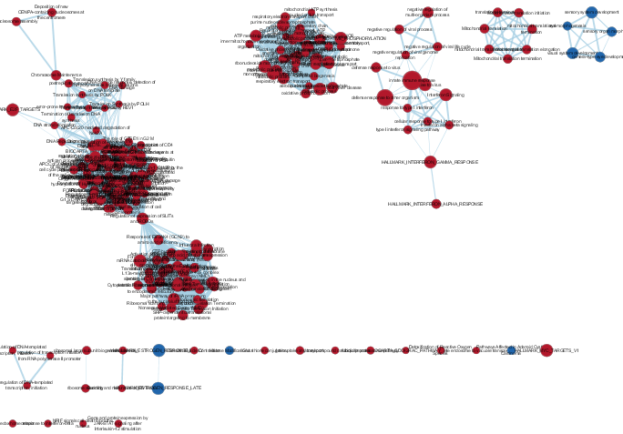
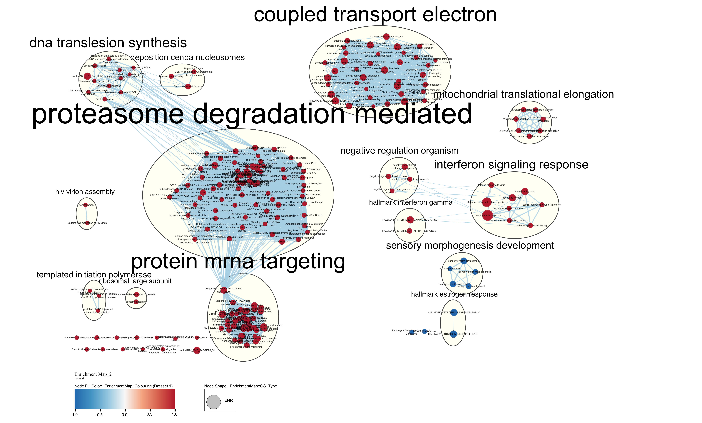
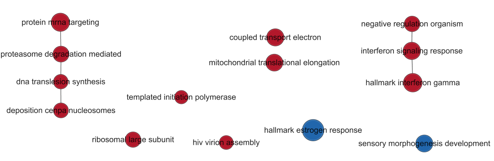
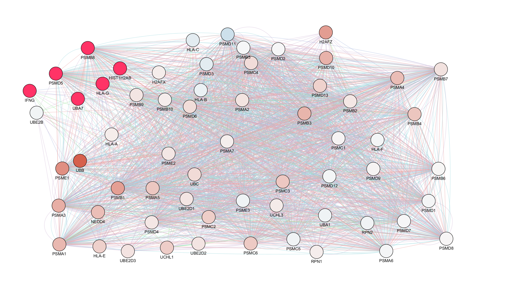
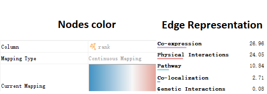

\pagebreak

```{r setup, include=FALSE}
knitr::opts_chunk$set(eval = TRUE, message=FALSE, warning=FALSE, echo = FALSE)
```

```{r, eval = TRUE}
if (!requireNamespace("BiocManager", quietly = TRUE)){
    install.packages("BiocManager")
}

if (!requireNamespace("ComplexHeatmap", quietly = TRUE)){
  BiocManager::install("ComplexHeatmap")
}
library(ComplexHeatmap)

if (!requireNamespace("circlize", quietly = TRUE)){
  BiocManager::install("circlize")
}
library(circlize)

if (!requireNamespace("edgeR", quietly = TRUE)){
  BiocManager::install("edgeR")
}

library(edgeR)

if (!requireNamespace("knitr", quietly = TRUE)){
  BiocManager::install("knitr")
}

if (!requireNamespace("limma", quietly = TRUE)){
  BiocManager::install("limma")
}
library(limma)

if (!requireNamespace("RCy3", quietly = TRUE)){
  BiocManager::install("RCy3")
}
library(RCy3)

if (!requireNamespace("RCurl", quietly = TRUE)){
  BiocManager::install("RCurl")
}
library(RCurl)

if (!requireNamespace("Biobase", quietly = TRUE)){
  BiocManager::install("Biobase")
}
library(Biobase)

if (!requireNamespace("ggplot2", quietly = TRUE)){
  install.packages("ggplot2")
}
library(ggplot2)

if (!requireNamespace("httr", quietly = TRUE)){
  install.packages("httr")
}
library(httr)

if (!requireNamespace("RJSONIO", quietly = TRUE)){
  install.packages("RJSONIO")
}
library(RJSONIO)

if (!requireNamespace("GSA", quietly = TRUE)){
  install.packages("GSA")
}
library(GSA)
```

# Introduction

Here we are analyzed about GSE114260 dataset, detailed information about this dataset is given below.

**Platform title:** Illumina HiSeq 2000 (Homo sapiens)

**Submission data:** Nov 02 2010

**Last update data:** Mar 27 2019

**Organism:** Homo sapiens

**Number of GEO datasets that use this techology :** 7897

**Number of GEO samples that use this technology :** 122103

Refer to corresponding paper, **combined** in file name means this file contains samples from both human and mice, since we only care about human, don't need to use the two **combined** file. Therefore, the **stranded_read_counts** is the data file of interest.

To clarify, **ER** in this data set stands for **estrogen receptor**, not **Endoplasmic reticulum**.In this dataset, we have 2 groups with 3 replicates each, so 6 samples in total. C4-12ERaERE (ER lacking cell line stably transfected with ERaERE) relative to the MCF7 cells were used for RNAseq analysis. The treatment group undergo paroxetine and estrogen (E2) treatment, while in control group there is only paroxetine treatment.

Raw data has been normalized using trimmed mean approaches. The we performed threshold over-representation analysis, by g:Profiler, on the normalized dataset. The enrichment analysis result support conclusion in the original paper.Top gene returned is ESR1 and top term returned is ‘GO:0006614 SRP-dependent cotranslational protein targeting to membrane’. Refer to gene summary provided by HGNC, ESR1 encodes an estrogen receptor. In addition, there are paper shows that term ‘GO:0006614 SRP-dependent cotranslational protein targeting to membrane’ is related to breast cancer. Since the orignal paper conclude that response of a certain drug for breast cancer is dependent on ER, the conclusion is supported.
```{r}
combined <- read.csv('combined.csv')
knitr::kable(combined[1:10,1:4], caption = 'top 10 gProfiler ORA result',digits = 3, format = 'pandoc', align = 'c')
```

\pagebreak

# Non-threshold Gene Set enrichment analyisis

## method

Choose GSEA(version 4.0.3) preranked analysis[@subramanian2005gene] since here we are using a ranked gene list. Database used is from bader lab, publised April 1st, 2020[@merico2010enrichment]. Gene set permutation is the default and only choice for preranked analysis in GSEA. As for minimum gene set size, default GSEA setting ,which is 15, remain unchanged. However, maximum size of gene set is reduced to 200 in order to reduce runtime. Number of permutation is 1000.

```{r runGSEA,eval = TRUE}
gmt_file <- 'Human_GOBP_AllPathways_no_GO_iea_April_01_2020_symbol.gmt'
rnk_file <- 'rank.rnk'
analysis_name <- "GSEA_result_max200"

#command <- paste("",params$gsea_jar,  "GSEAPreRanked -gmx", gmt_file, "-rnk" ,file.path(working_dir,rnk_file), "-collapse false -nperm 1000 -scoring_scheme weighted -rpt_label ",analysis_name,"  -plot_top_x 20 -rnd_seed 12345  -set_max 200 -set_min 15 -zip_report false -out" ,working_dir, " > gsea_output.txt",sep=" ")

command <- paste(params$gsea_jar, "GSEAPreranked -gmx",
                 file.path(params$working_dir,gmt_file),
                 "-collapse No_Collapse -mode Max_probe -norm meandiv -nperm 1000 -rnk",
                 file.path(params$working_dir,rnk_file),
                 "-scoring_scheme weighted -rpt_label",
                 analysis_name,
                 "-create_svgs false -include_only_symbols true -make_sets true -plot_top_x 20 -rnd_seed timestamp",
                 "-set_max 200 -set_min 15 -zip_report false -out /home/bioc/rstudio/projects")
system(command)

gsea_directories <- list.files(path = params$working_dir, pattern = "\\.GseaPreranked")
gsea_output_dir <- gsea_directories[grepl(analysis_name,gsea_directories)]
write.csv(gsea_output_dir,'gsea_output.txt',row.names = FALSE, col.names = FALSE)
```

## Result

### Summary

Upregulated correspond to upregualted in treated samples and downregulated correspond to downregulated in treated sample.

In upregulated category, top gene returned is	SELENOCYSTEINE SYNTHESIS%REACTOME%R-HSA-2408557.2, pvalue = 0.000, ES = 0.85, NES = 3.01, FDR = 0.000.

In downregulated category, top gene returned is HALLMARK_ESTROGEN_RESPONSE_EARLY%MSIGDB_C2%HALLMARK_ESTROGEN_RESPONSE_EARLY, pvalue = 0.000, ES = -0.77, NES = -2.69, FDR = 0.000.

### Top 10 upregulated from GSEA
```{r}
gsea_result <- as.character(read.delim('gsea_output.txt')[1,1])
identifier <- tail(unlist(strsplit(gsea_result,'\\.')),n=1)
neg <- read.delim(paste(gsea_result,"/gsea_report_for_na_neg_",identifier,'.xls',sep=""))
pos <- read.delim(paste(gsea_result,"/gsea_report_for_na_pos_",identifier,'.xls',sep=""))
knitr::kable(pos[1:10,c(1,2,4:11)], format = 'pandoc')
```

\page

### Top 10 downregulated from GSEA
```{r}
knitr::kable(neg[1:20,c(1,2,4:11)], format = 'pandoc')
```

## Comparision

Compare to result from thresholded over-representation analysis, there are several common terms.

Between GSEA upregulated result and ORA result:SRP-dependent cotranslational protein targeting to memebrane, cotranslational protein targeting to membrane, protein targeting to ER and establishment of protein localization to endoplasmic reticulum. Moreover, in ORA result, we have term 'translational initiation', while in upregualted GSEA result, we have 'CAP-dependent translational initiation' and 'eukaryotic translation initiation'

No common terms in top 20 terms from downregulated GSEA and ORA result.


Also, we checked common gene related to both results. Number of common gene is given in venn diagram. Detailed list of common gene are listed.

This is a straight forward comparision.

```{r}
ORA <- unlist(strsplit(as.character(combined[1:10,10]),','))
ORA <- unique(ORA)
find_probe <- function(GSEA_result){
  result <-c()
  for(i in 1:20){
    file <- read.delim(paste(gsea_result,"/",as.character(GSEA_result$NAME[i]),'.xls',sep=''))
    gene <- as.character(as.data.frame(file)$PROBE[file$CORE.ENRICHMENT=='Yes'])
    result <- c(result,gene)
    }
  return(unique(result))
}
pos_probe <- find_probe(pos)
neg_probe <- find_probe(neg)

pos_ORA <- c(ORA,pos_probe)
neg_ORA <- c(ORA,neg_probe)

pos_ORA_intersection <- intersect(ORA,pos_probe)
neg_ORA_intersection <- intersect(ORA,neg_probe)
len_neg_ORA <- length(neg_ORA_intersection)
len_pos_ORA <- length(pos_ORA_intersection)
vennDiagram(vennCounts(cbind(unique(pos_ORA)%in%pos_probe,unique(pos_ORA)%in%ORA)),names = c('GSEA upregulated','ORA'))
vennDiagram(vennCounts(cbind(unique(neg_ORA)%in%neg_probe,unique(neg_ORA)%in%ORA)),names = c('GSEA downregulated','ORA'))

overlap_table <- data.frame(pos_ORA_intersection[1:len_neg_ORA])
for(i in 1:floor(len_pos_ORA/len_neg_ORA-1)){
  if(length(pos_ORA_intersection[(len_neg_ORA*(i+1)):len_pos_ORA])<len_neg_ORA){
    overlap_table <- cbind(overlap_table,
                           c(pos_ORA_intersection[(len_neg_ORA*i+1):len_pos_ORA],rep('',len_neg_ORA*(i+2)-len_pos_ORA)))
    }
  else{overlap_table <- cbind(overlap_table,pos_ORA_intersection[(len_neg_ORA*i+1):(len_neg_ORA*(i+1))])
  }
}

overlap_table <- cbind(overlap_table, data.frame(neg_ORA_intersection))
colnames(overlap_table) <- c("Upregulated",rep('Upregulated cont',ncol(overlap_table)-2),"Downregulated")

knitr::kable(overlap_table,
             caption='Common Genes between GSEA result and ORA result', format = 'html')
```


# Cytoscape

Though I can run GSEA successfully in docker container, for reasons I don't know, when I tried to run docker by code in the docker container. It always returns

"Error in curl::curl_fetch_memory(url, handle = handle) : 

Failed to connect to localhost port 1234: Connection refused"

So I decided to create the html notebook for cytoscape pipeline outside the container, then merge the resulstant image file directly into the final hrml report. The cytoscape pipeline file are also submitted, named **EM pipeline.Rmd**. Since the GSEA result created by running code above in Docker container are causing problem becasue of in-Docker file path, I ran the code chunk for GSEA outside of docker first and ran cytoscape use this GSEA result. I manually set the path to GSEA result.

## Original EM before Manual Layout



This enrichment map is created with p-value cutoff = 0.005 and FDR q-value cutoff=0.005. This q-value is selected to reduce size of network

This enrichment map includes 224 nodes and 4610 edges. 24 of 356 nodes are isolated nodes.

Red node represent ,and blue nodes represents.

## Annotate Network

Used autoannotation for this step. Default parameter were chosen. Detailed parameter information are listed below:

* **Cluster Source**: clusterMaker2
* **ClusterMaker Algorithm**: MCL Cluster
* **Edge Attribute**: EnrichmentMap:: simlilarity_coefficient
* **Label Maker**: WordCloud: Adjacent Words(default)
* **Max Words Per Label**: 3
* **Word Adjancency Bonus**: 8
* **Normalization Factor**: 5
* **Attribute Names**: [EnrichmentMap::GS_DESCR]
* **Display style**: Clustered-Standard
* **Max Words per Cloud**: 250
* **Cluster Cutoff**: 1.0
* **Min Word Occurrence**: 1

Additional Information about the EnrichmentMap:

*Size of node correspond to size of geneset.
*Red nodes correspond to upregulated, blue nodes correspond to downregulated.
*Labels of node are geneset description.
*Thickness of the edge correspond to similarity coefficient. The more genes two nodes share in common, the thicker the edge.


## Publication-ready figure




## Theme Network




# Interpretation

Similar to result from assignment 2, GSEA and enrichment map result support the original paper.

Recall the original paper[@petrossian2018eralpha], it says that the ER treatment is important for increased CDK4/6 response in HR+ breast cancer. Refer to our enrichment map, proteasome degradation is an important feature that related to upregulated enrichment result. Proteasome degradation leads to inhibited proteasome activity, which could increase tumour killing by decrease concenration of P-glyco-protein in membrane cells.[@orlowski2002role] In addition, mitocchondrial translational elongation is also upregulated term. Since mitochodrial dysfunction is associated with increased aggressiveness of breast cancer[@lunetti2019metabolic], upregulated translational elongation is supposed to be able to help breast cancer patient. Moreover, estrogen response, which is positively related to cancer cell growth[@petrossian2018eralpha], is downregulated.

Therefore, the conclusion of the original paper is supported by our analysis.

## Specific pathway

Here I chose proteasome degradation. There are 2 reasons for chosing this pathway. First, this is a major pathway that clearly related to increased tumour killing. Second, size of its geneset is relatively large.

Here I use GeneMania, chose automatic network weighting and 0 max resultant gene, as default. Predicted link is the one weight the most in the resultant network, but I chose not to show this type of link since I'm more interested in confirmed relationships. In addition, I removed co-localization links.





I examined the gene node with highest rank, which are UBA7, IFNG, HLA-G, and PSMD5. UBA7 can perform as a marker for breast cancer patient since expression of UBA7 will be significantly reduced in breast cancer[@lin2020ubiquitin], however, here in our sample, expression of UBA7 is increased.As for IFNG, IFNG helps cancer therapy by facilitate tumor clearance and tumor escape [@ni2018interferon], therefore also has a positive effect in breast cancer therapies. HLA-G is rarely found in breast cancer tissues, but here it is highly upregulated[@palmisano2002analysis], which indicate the experiment treatment is related to positive effect on breast cancer.At, last PSMD5 encodes essential 26s subunit of proteasome, since we observed a highly upregulated score for proteasome degradation, it is reasonable that there is more proteasome synthesised. So result of examination on proteasome degradation is consistent with what I found on enrichment map.

# References

---
nocite: '@*'
...
